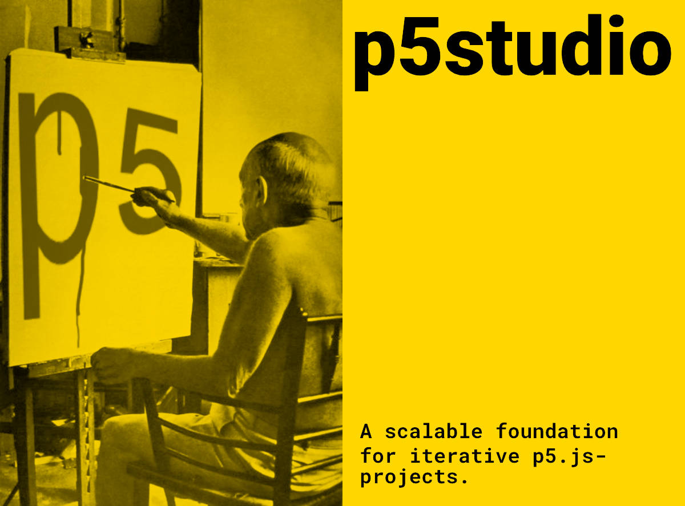

# p5studio



## "Always be iterating" – Zach Liebermann

Working with p5.js these days is still a bit difficult. Even though there's a pretty nice web-editor for the beginners out there, i've missed good solutions for more complex projects.

In the last years i spoke to dozens of creative coders from around the world and most of them confirm, that the transition from beginner to intermediate requires to jump over too mamy obstacles. This causes loss of motivation, which is the reason why many creative coders do not reach over the beginners-level or stop coding at all.

This application aims to change that.

## How it works

p5studio aims to be the perfect foundation for any complex p5.js-project. It solves tons problems:

- It automatically creates a html-file with a overview of all sketch-folders
- Assets like fonts and images can be saved globally in the data-folder, so all sketches can easily access them. The 'app.js'-script automatically saves all font-filenames in a JSON-file in the fonts-folder, so we are abled to load the fonts asynchronously while running our sketches
- It automatically saves all image-filenames in a JSON-file in the images-folder.
- It is based on a Gulp-process that uses Babel to transpile the Javascript
- It automatically compiles all js files from the src-folder and its subfolders to an app.js

## Scripts

The app-script scans the images-folder and the font-folder and generates for each a JSON-file with the list of the contents. This enables us to load files in our sketches-folders.

```js
node app.js
```

If you want to deploy one of your sketches as a standalone app you can do so by running build.js. The app will save all the files needed to the `build`-folder

```js
node build.js
```

If you want to work on any sketch inside the sketches-folder, run `gulp` from the command-line. It will bundle your Javascript-files from the src-folder, start browsersync and a watch-task.

```js
gulp;
```
