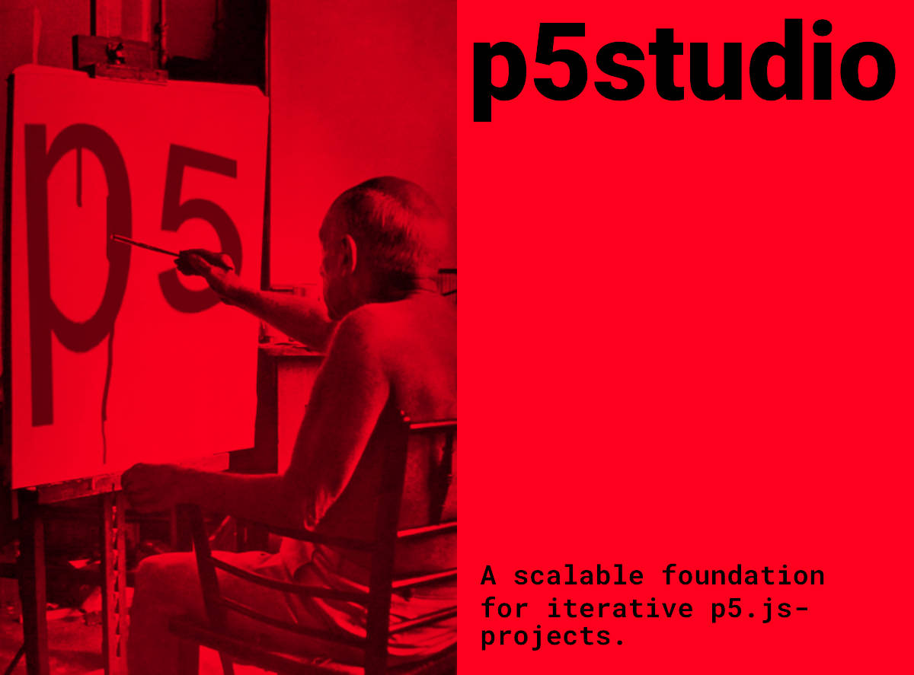

# p5studio



Working with p5.js these days is still a bit difficult. Even though there's a pretty nice web-editor for the beginners out there, there are no best practices for a workflow for more complex projects yet.

Working with p5.js these days is difficult. Even though there's a pretty nice web-editor for the beginners out there, there are no best practices for a workflow for more complex projects yet. The transition between beginners-work and a more advanced setup is too hard. This application aims to change that.

It supports an iterative and creative development-process with p5.js and any other library as good as possible. It solves numerous problems:

- It automatically creates a list of sketch-folders from the sketches-folder
- It automatically saves all font-filenames in a JSON-file in the fonts-folder, so we are abled to use the fonts later on in our sketches
- It automatically saves all image-filenames in a JSON-file in the images-folder.
- It is based on a Gulp-process that uses Babel to transpile the Javascript
- It automatically compiles all js files from the src-folder and its subfolders to an app.js

## Scripts

The app-script scans the images-folder and the font-folder and generates for each a JSON-file with the list of the contents. This enables us to load files in our sketches-folders.

```js
node app.js
```

If you want to deploy one of your sketches as a standalone app you can do so by running build.js. The app will save all the files needed to the `build`-folder

```js
node build.js
```

If you want to work on any sketch inside the sketches-folder, run `gulp` from the command-line. It will bundle your Javascript-files from the src-folder, start browsersync and a watch-task.

```js
gulp;
```
